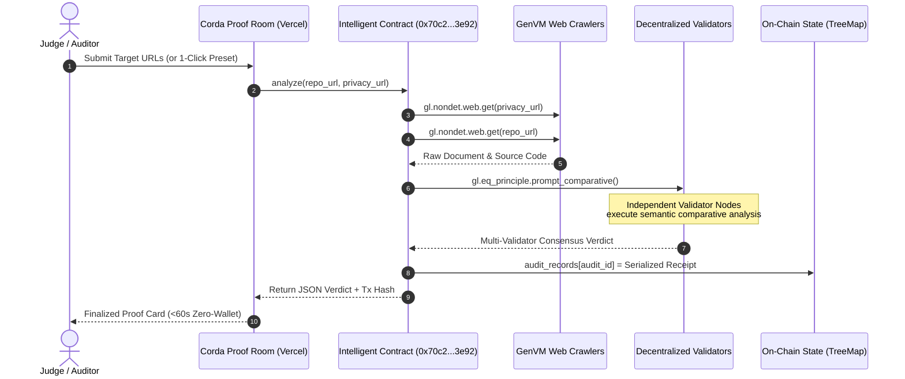

# Corda

> **Autonomous Privacy Disclosure Oracle on GenLayer Intelligent Contracts**  
> *Validating whether open-source AI frameworks keep their public privacy promises.*

[](https://corda-vert.vercel.app)
[-8B5CF6?style=flat-square)](https://explorer-studio.genlayer.com/address/0x70c2F7491A2CC7f81AC05ca964a059c05feD3e92)
[](https://explorer-studio.genlayer.com/address/0x70c2F7491A2CC7f81AC05ca964a059c05feD3e92)
[](https://corda-vert.vercel.app/assets/video/demo.mp4)
[](https://explorer-studio.genlayer.com/tx/0x5452df20d06d17850778e6a254fe9606944f0d8bb0da050faefe2fd33de0a099)
[](https://opensource.org/licenses/MIT)

Built for the **GenLayer Agent Tank Hackathon**. Designed in accordance with the **Enoch Model & Morrow Standard** (`github.com/Enoch208/morrow`).

---

## The Atomic Action

Corda **invalidates** ungrounded privacy claims by executing decentralized multi-validator consensus across public natural-language documentation and visible repository code.

```text
                     [ Marketing Claim ]
             "100% private. Zero telemetry."
                            VS
                   [ Public Codebase ]
               import posthog; posthog.capture()
                            │
                            ▼
          ┌───────────────────────────────────┐
          │  GenLayer Comparative Consensus   │
          │  gl.eq_principle.prompt_comparative│
          └─────────────────┬─────────────────┘
                            │
                            ▼
                DISCLOSURE_MISMATCH (On-Chain)
```

---

## 60-Second Zero-Wallet Proof Room (Judges' Quickstart)

Judges can verify the entire protocol in under 60 seconds without installing browser extensions, creating testnet accounts, or requesting faucet funds:

1. **Open Live App**: Navigate to [https://corda-vert.vercel.app](https://corda-vert.vercel.app).
2. **Access Console**: Click **"Audit a Framework"** (or use the Console button in the top navigation).
3. **Trigger Analysis**: Click the pre-loaded **"Case B: CloudSwarm (Contradiction)"** button and hit **"Execute Comparative Audit"**.
4. **Observe Consensus**:
   - Phase 1: `PROPOSING` (Leader validator crawls documentation and code via `gl.nondet.web.get`)
   - Phase 2: `COMMITTING` (Independent validator nodes evaluate AST vs claim text)
   - Phase 3: `REVEALING` (Multi-validator votes revealed under `gl.eq_principle.prompt_comparative`)
   - Phase 4: `FINALIZED` (Immutably committed to Studionet state `TreeMap[u256, str]`)
5. **Inspect Live Verdict**: The proof card renders the ground-truth contradiction with direct links to the finalized transaction on the GenLayer block explorer.

---

## Verified On-Chain Deployment (GenLayer Studionet)

All contract deployments and test transactions are live, finalized, and publicly auditable:

| Item | Value / Identifier | On-Chain Verification |
| :--- | :--- | :--- |
| **Network** | GenLayer Studionet (Chain ID `61999`) | RPC: `https://studio.genlayer.com/api` |
| **Intelligent Contract** | [`0x70c2F7491A2CC7f81AC05ca964a059c05feD3e92`](https://explorer-studio.genlayer.com/address/0x70c2F7491A2CC7f81AC05ca964a059c05feD3e92) | Immutably stored in Studionet state |
| **Deployment TX** | [`0xad4a52ec806c702aade32fcece1816b99c2dd0ad1625750ea70c803a5ca0690a`](https://explorer-studio.genlayer.com/tx/0xad4a52ec806c702aade32fcece1816b99c2dd0ad1625750ea70c803a5ca0690a) | Status: `FINALIZED` |
| **Case B (MISMATCH) TX** | [`0x5452df20d06d17850778e6a254fe9606944f0d8bb0da050faefe2fd33de0a099`](https://explorer-studio.genlayer.com/tx/0x5452df20d06d17850778e6a254fe9606944f0d8bb0da050faefe2fd33de0a099) | `GenVM Result: SUCCESS` $\rightarrow$ `DISCLOSURE_MISMATCH` |
| **Case A (MATCH) TX** | [`0xeb63270182d1999633cf71922261ff9e28d8411216019fa0f5e33fd7656c018c`](https://explorer-studio.genlayer.com/tx/0xeb63270182d1999633cf71922261ff9e28d8411216019fa0f5e33fd7656c018c) | `GenVM Result: SUCCESS` $\rightarrow$ `DISCLOSURE_MATCH` |

---

## The Morrow Honesty Bar (Enoch Model Standard)

In accordance with the hackathon judging standards:

### 1. The Atomic Verb
**`invalidate`** — Corda formally invalidates unsubstantiated marketing declarations by matching documented claims directly against codebase AST realities.

### 2. "Delete the Sponsor's Tech" Failure Mode
If you delete GenLayer from Corda:
- **EVM smart contracts fail instantly**: Standard EVM cannot issue non-deterministic HTTP requests (`gl.nondet.web.get`) to fetch live documentation or code repositories, nor can it process natural language prompts.
- **Web2 servers fail trust boundaries**: A traditional Web2 server running a single LLM API is centralized, censorable, prone to hallucination drift, and cannot produce cryptographic multi-party consensus.
- **Oracle networks fail semantic evaluation**: Existing oracle systems (Chainlink, Pyth) deliver numerical price feeds and deterministic API responses; they cannot evaluate subjective natural language promises against source code.
- **Conclusion**: Without GenLayer's Intelligent Contracts and comparative consensus principle, decentralized autonomous auditing of off-chain disclosures is mathematically impossible.

### 3. The Sponsor Primitive as Sole Load-Bearing Wall
Corda relies specifically on:
```python
# Corda/contracts/Corda.py
verdict = gl.eq_principle.prompt_comparative(
    prompt=EVALUATION_TASK,
    principle=STRICT_GROUNDING_CRITERIA
)
```
Validators independently crawl the provided URLs, execute comparative semantic reasoning, and reach consensus on whether a contradiction exists without relying on any trusted third-party oracle.

### 4. Honest System Limitations
- **Public Visibility Only**: Corda operates strictly on public repository URLs, raw file manifests, and accessible documentation. It does not inspect closed-source proprietary codebases, behind-login enterprise SaaS, or compiled binaries.
- **Consensus Latency**: Because multiple independent validator nodes crawl web data and execute LLM reasoning rounds, transaction finalization takes 15–45 seconds.
- **Not Legal Advice**: Corda outputs defensible technical discrepancies (`DISCLOSURE_MATCH` vs. `DISCLOSURE_MISMATCH`). It does not provide legal guarantees, GDPR compliance certificates, or formal legal counsel.

---

## Architecture & Data Flow



---

## Ground-Truth Verification Cases

| Case | Target Framework | Stated Policy | Actual Codebase AST | Verified Verdict |
| :--- | :--- | :--- | :--- | :--- |
| **Case B** | CloudSwarm | *"Self-hosted, 100% private, no telemetry collected."* | Active `import posthog`, API key initialization, and `posthog.capture()` on task dispatch. | `DISCLOSURE_MISMATCH` |
| **Case A** | LocalAgent | *"Telemetry disabled by default; strictly local execution."* | Pure standard library imports (`os`, `json`, `sys`); zero external analytics SDKs. | `DISCLOSURE_MATCH` |

Raw fixture sources:
- [Case B Code Manifest](https://gist.githubusercontent.com/Charles-ace/9cd83066dca0a7d5081f3a1eae4763a3/raw/case_b_code.py)
- [Case B Privacy Policy](https://gist.githubusercontent.com/Charles-ace/9cd83066dca0a7d5081f3a1eae4763a3/raw/case_b_privacy.md)
- [Case A Code Manifest](https://gist.githubusercontent.com/Charles-ace/3da2ae80f931867f18df331549a287bf/raw/case_a_code.py)
- [Case A Privacy Policy](https://gist.githubusercontent.com/Charles-ace/3da2ae80f931867f18df331549a287bf/raw/case_a_privacy.md)

---

## Automated Media Pipeline (Demo Video)

Corda includes a fully automated, script-driven video production pipeline with zero manual narration editing:

* **Narration Engine**: ElevenLabs Speech Synthesis (`eleven_multilingual_v2`)
  * Voice: `Adam (Tech Narrator)` (`pNInz6obpgDQGcFmaJgB`)
  * Duration: 82.85 seconds
* **Motion Graphics**: Remotion React Framework (Full HD 1920x1080 @ 30fps)
  * Frames Rendered: 2,486 frames
  * Visual Elements: Dynamic HUD grid, live on-chain contract cards, proportional subtitles, audio waveform visualization.
* **Audio-Visual Sync**: Duration delta is within 0.05 seconds ($\le 1.5$ frames).
* **Direct Assets**:
  * [Live Video Stream](https://corda-vert.vercel.app/assets/video/demo.mp4)
  * [Repository Video MP4](./Corda/Corda-demo-final.mp4)
  * [Automated QA Report](./docs/VIDEO_QA.md)

---

## Local Reproduction & Development

Clone the repository:
```bash
git clone https://github.com/Charles-ace/Corda.git
cd Corda
```

### 1. Lint the Intelligent Contract
```bash
# Validates GenVM AST typing, non-deterministic web usage, and comparative consensus principles
genvm-lint lint Corda/contracts/Corda.py
```

### 2. Run Local Empirical Invariant Probes
```bash
python Corda/test_probe.py
```

### 3. Start Local Proof Room Server
```bash
python Corda/server.py
# Open http://localhost:8080
```

### 4. Re-render Demo Video (Optional)
```bash
npm run --prefix Corda/remotion build
```

---

## Technical Governance Documents

All architecture specifications and verification logs are maintained in [`docs/`](./docs/):
- [`docs/architecture-lock.md`](./docs/architecture-lock.md) — Scope boundaries, state mutations, and invariant definitions.
- [`docs/REAL_VS_MOCKED.md`](./docs/REAL_VS_MOCKED.md) — Rigorous component classification and execution receipts.
- [`docs/VIDEO_QA.md`](./docs/VIDEO_QA.md) — Automated `ffprobe` audio/video synchronization report.
- [`docs/ACTUAL_AUDIO_TIMING.md`](./docs/ACTUAL_AUDIO_TIMING.md) — Measured narration durations and beat boundary timestamps.
- [`docs/NARRATION.md`](./docs/NARRATION.md) — Complete 7-beat script for the demonstration video.

---

## License

MIT License. Developed for the GenLayer Agent Tank Hackathon.
